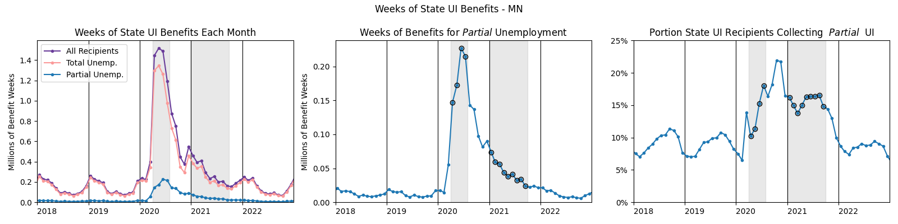
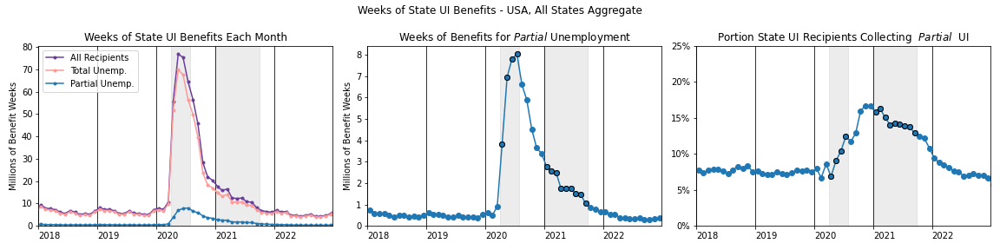
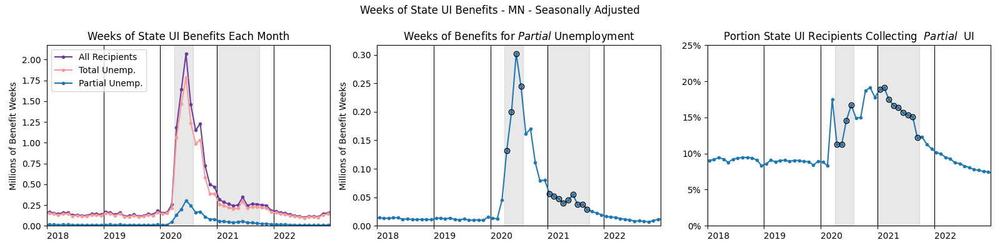
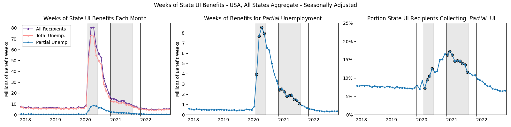

<!--last_modified_date: 2022-10-16-->

This page doesn't have any rigorous analysis. 
I just eyeball a few graphs.

## The Anecdote

I was talking to a restaurant manager, and they described how recalled employees still received the full federal bonus (600 then later 300 USD) to UI as long as they had reduced hours low enough to collect any UI benefits at all. Thus employees would aim to work just below this threshold, and only wanted longer hours again once the bonus 300 stopped being paid out.

I'm curious how common this kind of situation was.

## Some Graphs of UI Recipients

The following is a graph of participation in state unemployment insurance (UI) for the state of Minnesota,
plotted using datat from the Employment and Training Administration.[^ETAdata]

[^ETAdata]: Specifically, I used release [ETA 5159: Claims and Payment Activities](https://oui.doleta.gov/unemploy/DataDownloads.asp#ETA_5159). Series `c38` lists the number of weeks of unemployment insurance paid out. Series `c39` lists the number of weeks of UI paid for *total* unemployment. I calculated weeks of partial unemployment as `c38-c39`. Thanks to Peter Ganong for the tip on where to find this data.

The unit of unemployment insurance is "weeks", because people file for and collect UI on a weekly basis.
So someone collecting UI for the entire duration of a month will add 4+ weeks to the total.

During the pandemic, extra money was paid to those collecting UI.
From April-July in 2020, UI recipients received an extra 600 dollars from the federal government,
through the Pandemic Unemployment Assistance program
(and another bit of sporadic bonus was paid out in September 2020 via executive order.)
From January-September 2021, new legislation authorized a 300 dollar bonus. 
I've darkened these time periods in each graph.

"Total Unemployment" refers to those collecting UI because they aren't working.
They're unemployed in the BLS sense of the word. 
But people can also collect UI in some cases if their hours have been reduced 
(eg if hours are reduced because of a pandemic). 
This is labelled "partial unemployment".

The rules for when someone is eligible for partial UI vary from state to state.[^partialuitable]
In Minnesota (my state of residence during the pandemic), 
benefits smoothly taper off until you earn the WBA (weekly benefit amount - the benefits you would receive for total unemployment).
On top of that, I recall that my household received the full 600/300 dollar bonus
as long as we were receiving *any* UI. This means there was a hard nominal-income threshold
at which take-home income instantly dropped by several hundred dollars per week. 

[^partialuitable]: The Employment and Training Administration has [a description of each state's requirements for partial UI](https://oui.doleta.gov/unemploy/pdf/uilawcompar/2021/monetary.pdf). See page 3-18 and the following table 3-8. (There may have also been an executive order or guidance making the thresholds less strict? I might be misremembering there, though.)

But despite the anecdotal evidence I've heard of this cliff affecting labor decisions,
the graph doesn't paint a clear picture of a major effect. 
Maybe it was something specific to the restaurant industry?
🤷

<!--Maybe most bosses didn't pay attention to employee's effective marginal tax rates when assigning schedules.-->

Here's the same graph, adding up the state UI recipient counts from all the states in the US:

And here are the same two graphs with some quick seasonal adjustment on the time series:

<!--

## Data Source
https://oui.doleta.gov/unemploy/pdf/uilawcompar/2022/
https://oui.doleta.gov/unemploy/pdf/uilawcompar/2021/monetary.pdf
-->