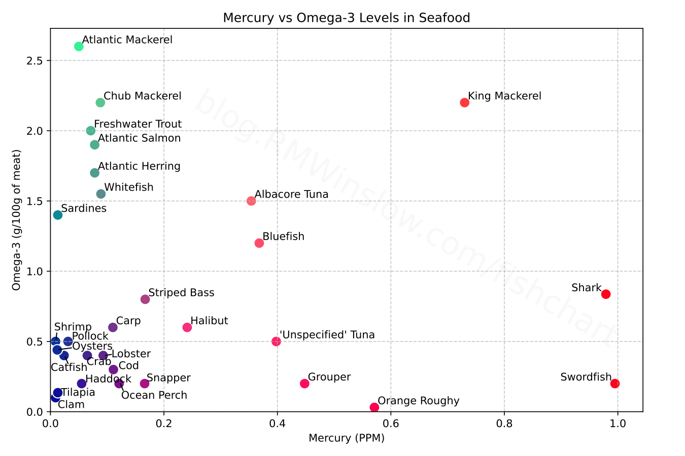

## Description

Omega-3 is good for the baby's development. 
Mercury is bad. 

In the chart above, the green dots are fish you should eat when pregnant.
Sardines and Atlantic Mackerel are both good choices.

The red dots are fish you should avoid.
Swordfish and Shark are the worst offenders. 
King Mackerel has lots of Omega-3, but also high mercury and so should be avoided.

There's a similar chart in Emily Oster's *Expecting Better* 
which I wanted to replicate for the sake of sharing.
For comparison, [here's a table from the fda](https://www.fda.gov/media/102331/download?attachment) and [here's one from the washington post](https://www.allthingsgym.com/seafood-infographic-omega-3-vs-mercury-levels/) with similar seafood recommendations.

## Details / Sources / Notes

Mercury Figures are from the FDA: [pdf of mercury values](https://downloads.regulations.gov/FDA-2014-N-0595-0149/content.pdf), [html of the same](https://www.fda.gov/food/environmental-contaminants-food/mercury-levels-commercial-fish-and-shellfish-1990-2012).

[Info on Omega-3 Fatty Acids is taken from this PDF](https://seafood.oregonstate.edu/sites/agscid7/files/snic/omega-3-content-in-fish.pdf).
For a few of these items (shark, tilapia, oyster, roughy), I took the omega-3 values from [Harris et al 2008](https://pubmed.ncbi.nlm.nih.gov/18937898/).

 
- In some cases, it wasn't 100% clear how to match up the fish varieties across charts, so I made a few judgement calls. Refer to the sources if you need the precise numbers.
- I didn't include *all* the fish that are found in both charts. It's possible I missed a few, and there are a few I removed because the chart is too crowded. 
    - Notably, flounder lines up with haddock, and sablefish with albacore tuna.
- The worst fish isn't actually on the chart. That would be tilefish from the Gulf of Mexico, with 1.123 ppm mercury. I didn't include it because:
    - It's an extreme point which would make the chart layout worse.
    - I couldn't easily find a credible citation for tilefish Omega-3 content.
    - I've never heard of tilefish before and so I don't really care.
- Harris et al gives the sum of two kinds of Omega-3 Fatty Acids (EPA+DHA) while the other Omega-3 table total of three kinds (EPA+DHA+α-Linolenic acid). I may go back at some point to remake this graph with a more apples-to-apples comparison, but the main difference is just that herring and whitefish would look a bit worse without the αLA.

