[This video by John Turner](https://www.youtube.com/watch?v=4uFahk0cuZU)
has a fun idea:
Looking at which words are 'shaped' the same. 
One of the ways he defines a word's shape is via its graph[^graphtheory] of letter adjacencies.
For example, "baboon" and "refers" have the same graph shape
because the network of connections between adjacent letters is similar.

[^graphtheory]: "Graph" as in "[graph theory](https://www.britannica.com/topic/graph-theory)", the study of networks and connections. To get a word's letter-adjacency graph: Each letter is a vertex. There is an edge connecting two letters if they show up next to each other in the word. The graphs are [simple graphs](https://mathworld.wolfram.com/SimpleGraph.html), meaning we don't connect a letter to itself (in words like "moon"), nor do we add extra edges when the same adjacency happens multiple times (in words like "donor").
<!--https://math.libretexts.org/Bookshelves/Combinatorics_and_Discrete_Mathematics/Combinatorics_and_Graph_Theory_(Guichard)/05%3A_Graph_Theory/5.01%3A_The_Basics_of_Graph_Theory-->

Unfortunately, despite using a graphing library called [Scott](https://github.com/theplatypus/scott) to compute canonical representations of each word's graph, 
what Turner has calculated doesn't seem to *actually* be (just) about graph isomorphism.
It also takes into account the position of letters around the "letter wheel".
I found this unsatisfyingly restrictive. 

Looking at just the networks of letter adjacency, "baboon" should be similar not just to words like 
"refers", 
but also to words like "cats" and "wooly".

The video made me curious what the results would look like when 
looking at just the graph of adjcencies between letters in a word.
(Henceforce "the word's graph" for short.)

This post *partially* answers that question
using the `enable1` dictionary of words from [this Github Repo](https://github.com/dolph/dictionary)

## Which Small Graphs are Missing?

### 4 or fewer nodes

<!--## Words With Only A Few Distinct Letters-->

If we're looking at words with four or fewer distinct letters,
there are only a few 'shapes' such a word graph could have.
([20, to be precise.](https://mathworld.wolfram.com/ConnectedGraph.html)) 
And every one of them has at least one corresponding word.

In fact, all of them except for the K4 complete graph have multiple words.
K4 only has one, and it's a bit iffy.
It's "gensengs", which is the plural of an alternate spelling of "ginseng".

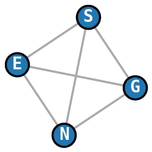

Should that count? well, it's in the dictionary I'm using, so 🤷

<!--TODO: image of all the graphs-->
<!--TODO: longest such word-->

### 5 nodes

Of the 21 simple connected graphs with 5 nodes, 
all are represented *except for one*.
The missing graph is K5, aka the *pentatope graph*.

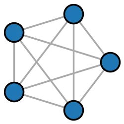

No word has this graph.
I also checked the larger words and none of them seem to contain this shape as a subgraph either.
*Spooky!*

----

Test of table with word

| Graph | Example Word | Visualization |
|:--|:--|:--|
|  | i |  |
|  | to | 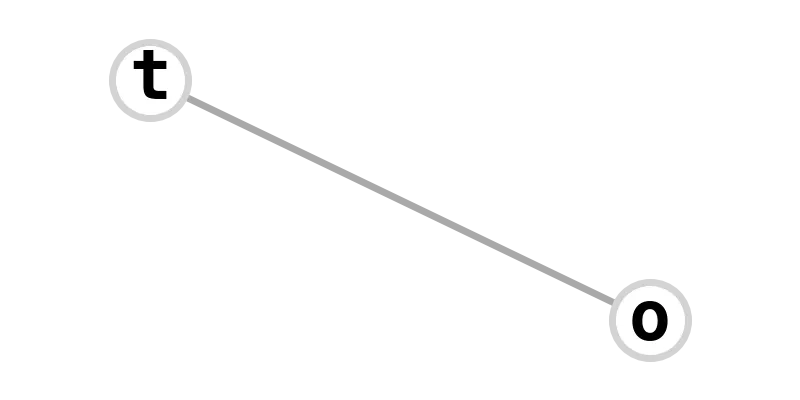 |
|  | air | 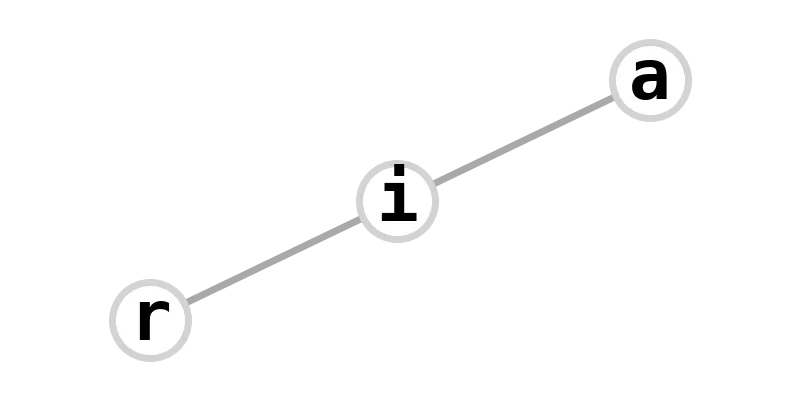 |
|  | aqua | 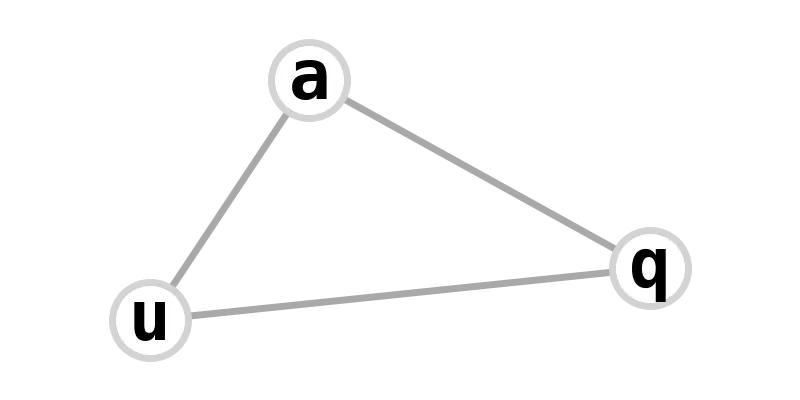 |
|  | catch | 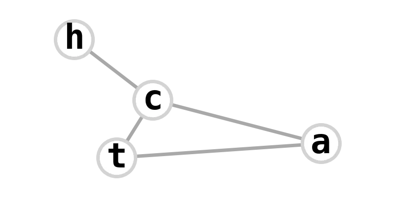 |
|  | fire | 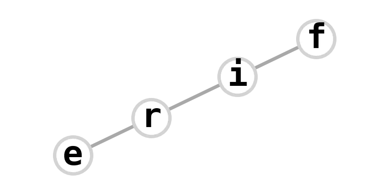 |
|  | miasma | 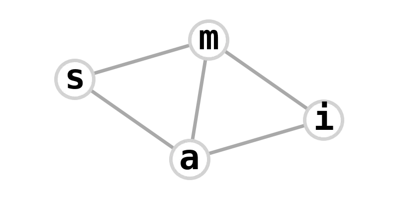 |
|  | anima | 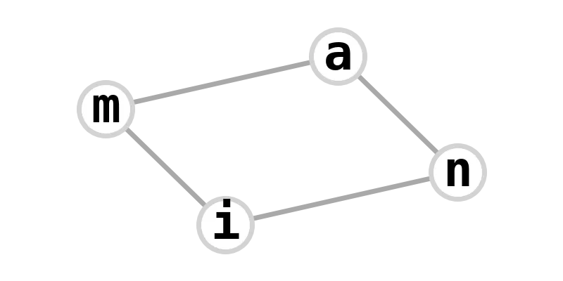 |
|  | gensengs | 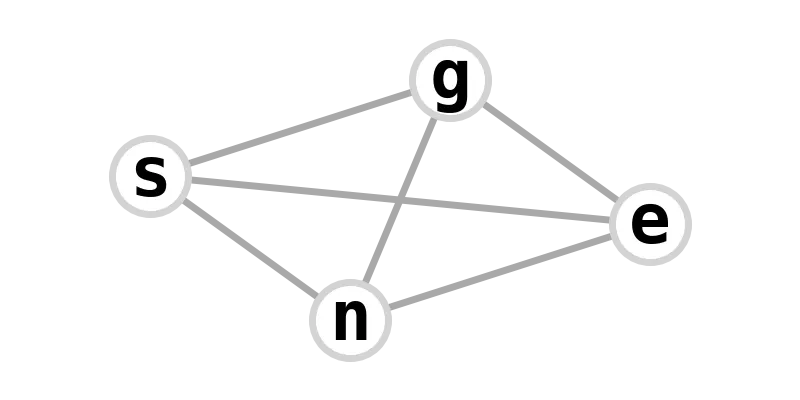 |
|  | absorb | 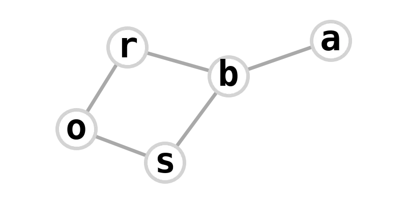 |
|  | elixir | 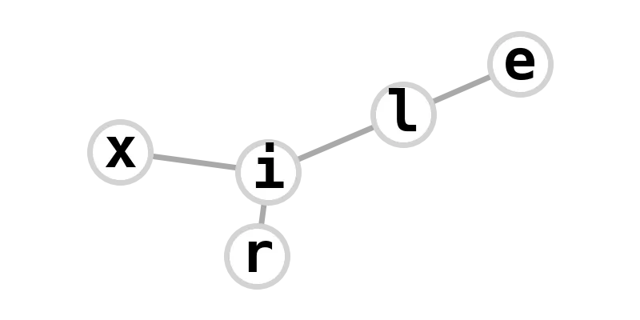 |
|  | propel | 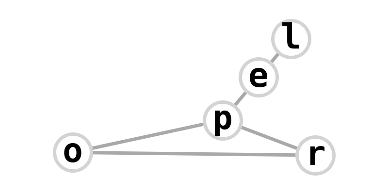 |
|  | alcohol | 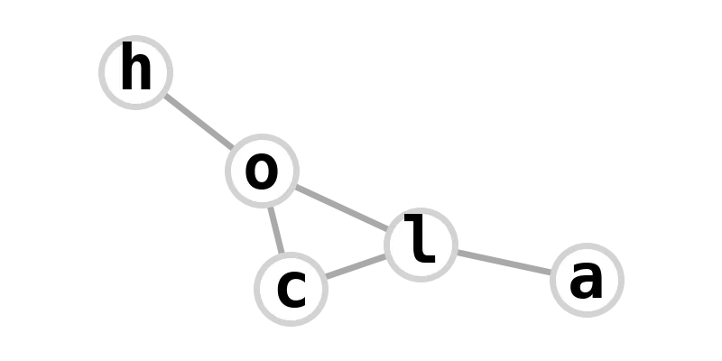 |
|  | calculus | 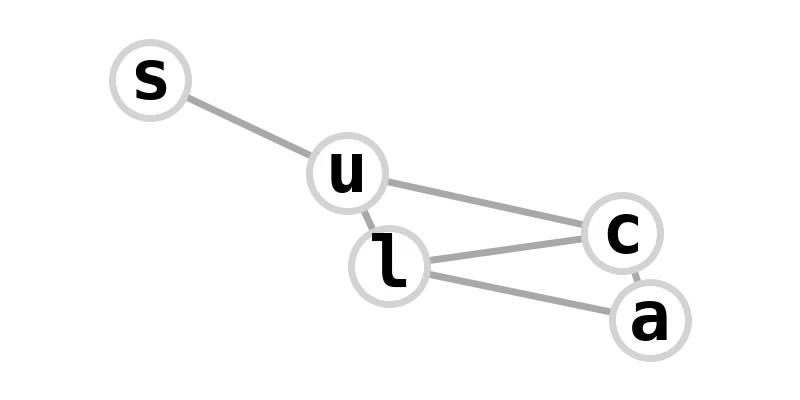 |
|  | tempest | 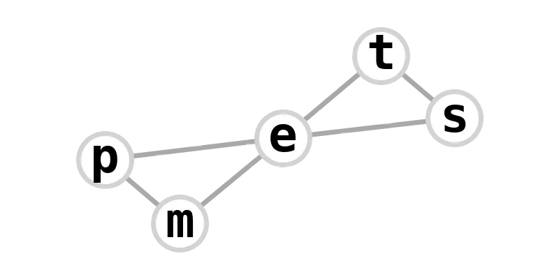 |
|  | torturous | 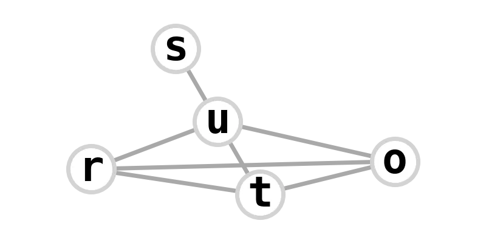 |
|  | aether | 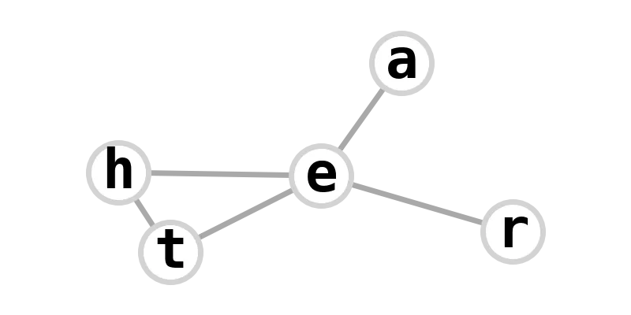 |
|  | earth | 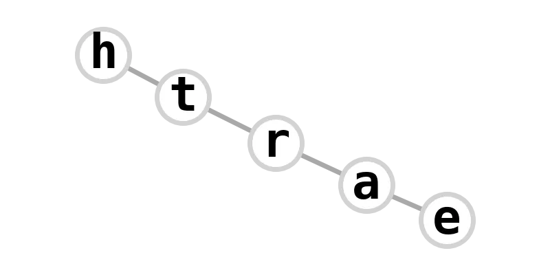 |
|  | instant | 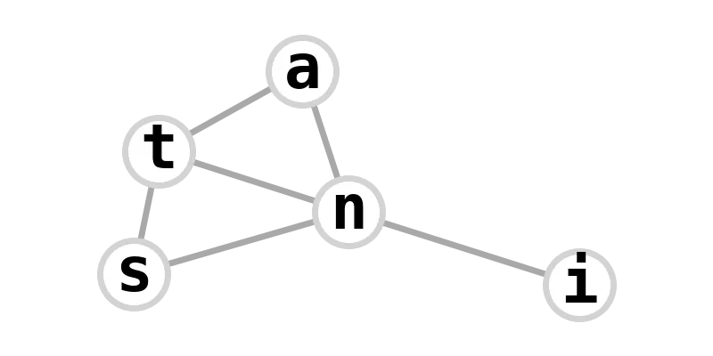 |
|  | kabbalah | 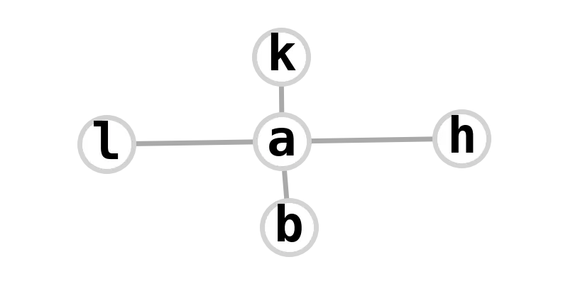 |
|  | seascape | 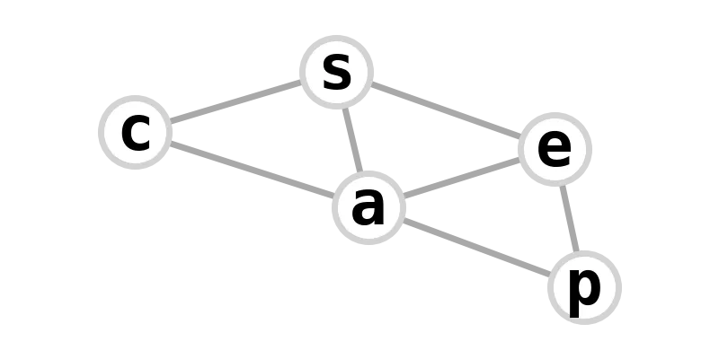 |
|  | loyalty | 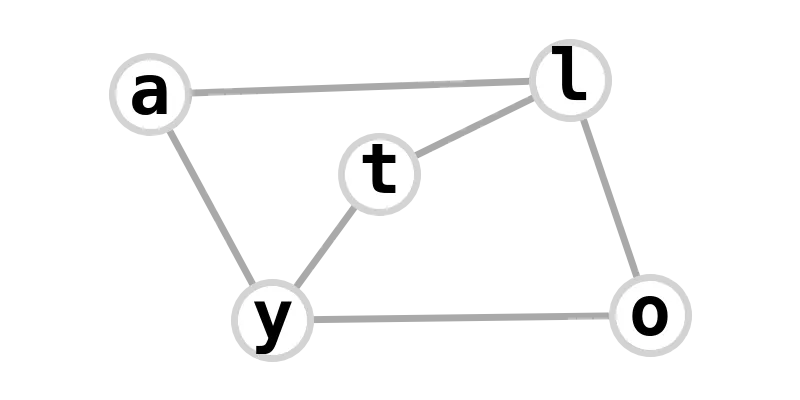 |
|  | automata | 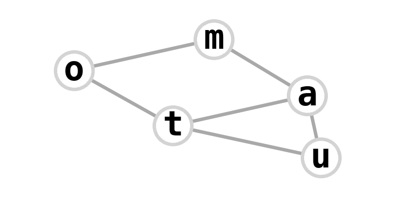 |
|  | attractant | 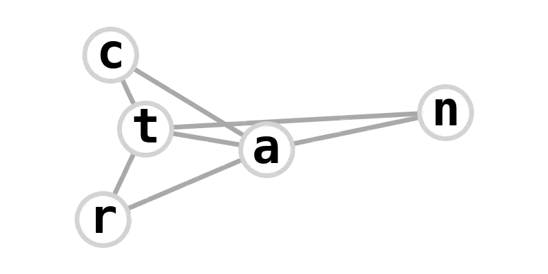 |
|  | lanolin | 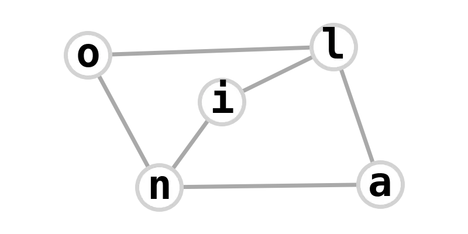 |
|  | exhume | 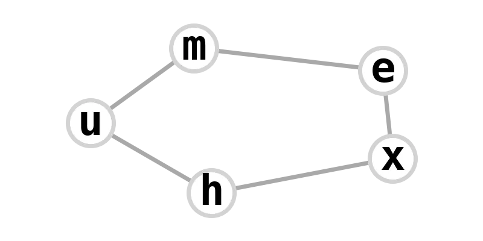 |
|  | intensities | 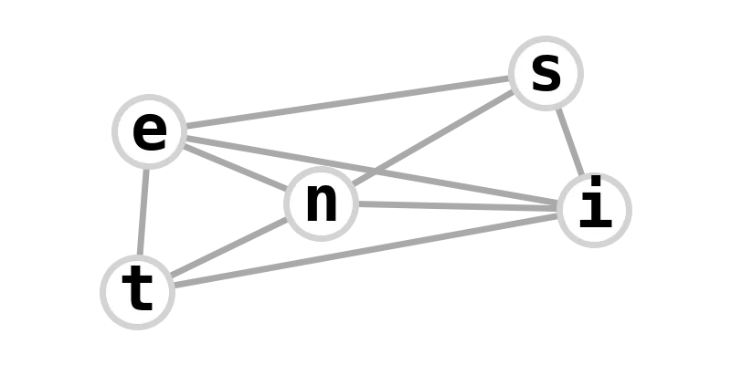 |
|  | nurturant |  |
|  | milliosmols | 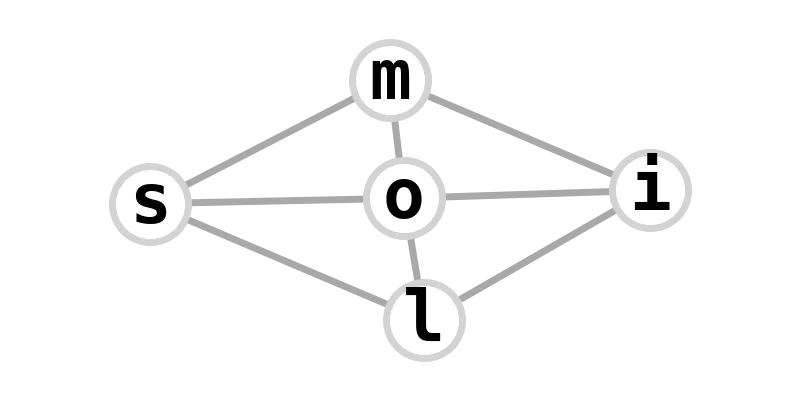 |

## Degree Sequence

