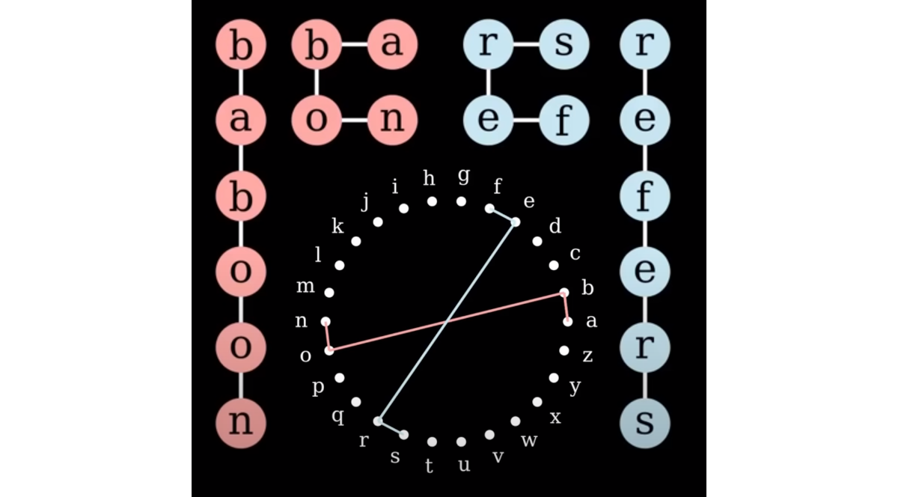

[This video by John Turner](https://www.youtube.com/watch?v=4uFahk0cuZU)
has a fun idea:
Looking at which words are 'shaped' the same. 
One of the ways he defines a word's shape is via its graph[^graphtheory] of letter adjacencies.
For example, "baboon" and "refers" have the same graph shape
because the network of connections between adjacent letters is similar.

[^graphtheory]: "Graph" as in "[graph theory](https://www.britannica.com/topic/graph-theory)", the study of networks and connections. To get a word's letter-adjacency graph: Each letter is a vertex. There is an edge connecting two letters if they show up next to each other in the word. The graphs are [simple graphs](https://mathworld.wolfram.com/SimpleGraph.html), meaning we don't connect a letter to itself (in words like "moon"), nor do we add extra edges when the same adjacency happens multiple times (in words like "donor").
<!--https://math.libretexts.org/Bookshelves/Combinatorics_and_Discrete_Mathematics/Combinatorics_and_Graph_Theory_(Guichard)/05%3A_Graph_Theory/5.01%3A_The_Basics_of_Graph_Theory-->




Unfortunately, despite using a graphing library called [Scott](https://github.com/theplatypus/scott) to compute canonical representations of each word's graph, 
what Turner has calculated doesn't seem to *actually* be (just) about graph isomorphism.
It also takes into account the position of letters around the "letter wheel".
I found this unsatisfyingly restrictive. 

Looking at just the networks of letter adjacency, "baboon" should be similar not just to words like 
"refers", 
but also to words like "cats" and "wooly".

The video made me curious what the results would look like when 
looking at just the graph of adjcencies between letters in a word.
(Henceforce "the word's graph" for short.)

This post *partially* answers that question
using the `enable1` dictionary of words from [this Github Repo](https://github.com/dolph/dictionary)

<!--## Which Small Graphs are Missing?-->

## Words With Only A Few Distinct Letters

If we're looking at words with five or fewer distinct letters,
there are only a few 'shapes' such a word graph could have.
([41, to be precise.](https://mathworld.wolfram.com/ConnectedGraph.html)) 

<!--TODO: longest such word-->

In the dictionary I looked at, all of these small graphs have corresponding words
*except for one*.


Test of mermaid diagram


```
graph TD
    A-->B
    A-->C
    B-->D
    C-->D
```
{: .mermaid}

```
graph TD 
    A[Client] --> B[Load Balancer] 
    B --> C[Server1] 
    B --> D[Server2]
```
{: .mermaid}


<pre class="mermaid">
    graph TD 
    A[Client] --> B[Load Balancer] 
    B --> C[Server1] 
    B --> D[Server2]
</pre>

<pre class="mermaid">
graph TD 
    A[Client] --> B[Load Balancer] 
    B --> C[Server1] 
    B --> D[Server2]
</pre>

<pre class="mermaid">
    graph TD; 
    A[Client] --> B[Load Balancer];
    B --> C[Server1];
    B --> D[Server2];
</pre>

<script type="module">
    import mermaid from 'https://cdn.jsdelivr.net/npm/mermaid@10/dist/mermaid.esm.min.mjs';
    mermaid.initialize({ startOnLoad: true });
</script>


## Degree Sequence


