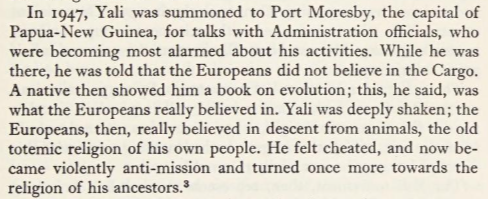
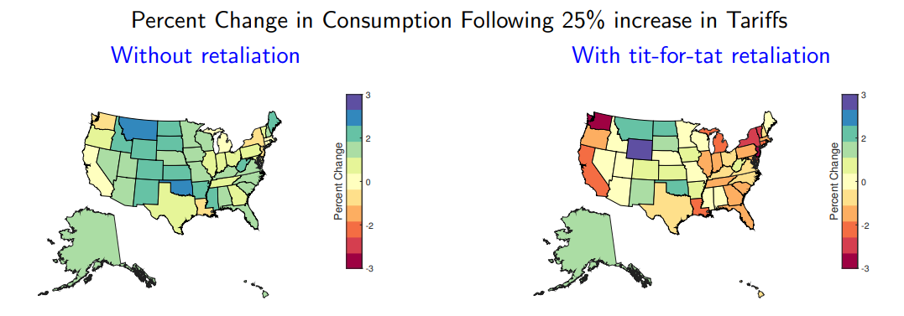

These are links I saved on my phone last month.

[WP: Nils Olav](https://en.wikipedia.org/wiki/Nils_Olav)
: "Major General Sir Nils Olav III, Baron of the Bouvet Islands is a king penguin who resides in Edinburgh Zoo, Scotland. He is the mascot and colonel-in-chief of the Norwegian King's Guard."

[A Story About ‘Magic'](http://catb.org/jargon/html/magic-story.html)
: Old hacker folklore.

[Claim about full flights](https://x.com/MCCCANM/status/1899547930014724158#m)
: "The government buys a certain amount of seats per day to various destinations. Say, DCA to LAX. Big companies, like Apple, do the same. If you need the seat, you have it. If you don’t, it goes empty. ... The gate agent explained to me that 16 seats were technically sold, but they were government & would probably go empty."

[During the Korean War, the Navy stole some trains from behind enemy lines, and a bunch of liquor along with it.](https://www.history.navy.mil/content/history/museums/seabee/explore/civil-engineer-corps-history/the-korean-war--the-inchon-landing--the-great-train-robbery-and-.html)
: "The Seabee chief subsequently admitted that sampling the beer and sake back at the brewery may have encouraged the Seabees to greater effort in getting the trains back to the U.S. lines."
: Learned of this from the following tweet:

<blockquote class="twitter-tweet">
During the Korean War, a detachment of Seabees went behind enemy lines to capture several locomotives. When they discovered that the switchyard was next to the Kiran Brewery, they quickly loaded the locomotives with cases of beer and sake, then managed to avoid heavy fire to… <a href="https://t.co/cc35cU4KFQ">pic.twitter.com/cc35cU4KFQ</a>
&mdash; U.S. Naval Institute (@NavalInstitute) <a href="https://twitter.com/NavalInstitute/status/1903566546196144228?ref_src=twsrc%5Etfw">March 22, 2025</a></blockquote> 

[The case of the missing human chromosomes](https://geneticsunzipped.com/transcripts/2019/4/25/the-case-of-the-missing-human-chromosomes)
: For several decades, we thought humans had 48 chromosomes instead of 46. 
: [Further discussion on Twitter.](https://x.com/BWalkerTTAGGG/status/1903480729683820574)

[WP: Fumi-e](https://en.wikipedia.org/wiki/Fumi-e)
: "A fumi-e (踏み絵, fumi "stepping-on" + e "picture") was a likeness of Jesus or Mary onto which the religious authorities of the Tokugawa shogunate of Japan required suspected Christians (Kirishitan) to step,"

[Edy’s Recipe Changed - Dining and Cooking](https://www.diningandcooking.com/1944459/edys-recipe-changed/)
: Edy's brand ice cream is no longer "ice cream". It's "frozen dairy desert". I noticed this at the store because exactly one tub of was a different color. That was the only actual ice cream on that shelf.

[Adam Rainer - Wikipedia](https://en.wikipedia.org/wiki/Adam_Rainer)
"Adam Rainer (1899 – 4 March 1950) was an Austrian man who was the only person in recorded history to have been both a dwarf and a giant." (He was 4 feet tall as an adult but then developed a pituitary tumor that led him to grow to over 7 feet tall.)

[Byrne’s Euclid](https://www.c82.net/euclid/about/)
: An interactive reproduction of Byrne’s 1847 edition of Euclid's elements. Really quite beautiful.

[Yali (politician) - Wikipedia](https://en.wikipedia.org/wiki/Yali_(politician))
: Yali was a WW2 vet turned cult leader. Very interesting figure. The claim I find most interesting is that he saw the theory of evolution as validation of his traditional beliefs.
: 
: - excerpt from "The trumpet shall sound". Peter Worsley, 1968

[Seriously bright light vs. winter blahs | Meaningness](https://meaningness.com/sad-light-lumens)
: Some tips for lighting up a room in dark winters.

[4th of July LARP](https://larpventure.com/4th-of-july)
: Polish larp where they pretend to be American hillbillies.

[Doxa, Episteme, and Gnosis.](https://mapandterritory.org/doxa-episteme-and-gnosis-ea35e4408edd)
: Doxa: Hearsay. "If you know the Earth is round because you read it in a book, that’s doxa."
: Episteme: Reasoned knowledge. "If you know the Earth is round because you measured shadows at different locations and did the math to prove that the only logical conclusion is that the Earth is round, that’s episteme."
: Gnosis: Personal experience. "If you know the Earth is round because you traveled all the way around it or observed it from space, that’s gnosis."
: The essay suggests that it's easy to confuse these different forms of knowledge. The reason that teaching is the best way to learn something is that is forces you to develop Episteme and not just Doxa.

[Tumultuous tax brackets | FRED Blog](https://fredblog.stlouisfed.org/2018/09/tumultuous-tax-brackets/)g
: The top marginal tax rate was above 90% until 1964.
: Note, however, that basically nobody paid that rate.
: [According to Piketty and Saez](https://eml.berkeley.edu/~saez/piketty-saezJEP07taxprog.pdf), there were lower capital gains taxes, and plenty of deductibles, so the *effective* top marginal tax rate wasn't nearly that high.
: The federal tax code really was a lot more progressive in the 60s but that's a result of high coporate and estate taxes, not the high marginal income tax. (See Figure 1 in the linked paper.)
<!--  -->

<!-- Effective Income Tax Rates Have Fallen for The Top One Percent Since World War II | Tax Policy Center -->
<!-- https://taxpolicycenter.org/taxvox/effective-income-tax-rates-have-fallen-top-one-percent-world-war-ii-0 -->

[Stevey's Google Platforms Rant · GitHub](https://gist.github.com/chitchcock/1281611)
: Classic rant from 2011 about the shortcomings of Google's approach compared to Amazon's. You need to be logged in to GitHub to read it.
: It lines up with things I've heard from the other side about whhy Amazon is so successful.

[Noisy Owl](https://noisyowl.com/)
: Collection of odd little games. I like this kind of cozy, messy, personal website.

[GPS Accuracy](https://www.gps.gov/systems/gps/performance/accuracy/)
: As a kid, I had been told that civilian GPS is required to be less accurate, but according to gps.gov, 
: "The user range error (URE) of the GPS signals in space is actually the same for the civilian and military GPS services. However, most of today's civilian devices use only one GPS frequency, while military receivers use two... Dual-frequency GPS equipment is commercially available for civilian use, but its cost and size has limited it to professional applications."

[Learning from the first (and only) manufactured housing boom | Federal Reserve Bank of Minneapolis](https://www.minneapolisfed.org/article/2025/learning-from-the-first-and-only-manufactured-housing-boom)
: Early state-by-state regulation of manufactured housing ("mobile homes") actually helped the industry by promoting consumer trust.
: But the federal regulation required that the chassis be permanently attached, which spelled doom for the industry. The chassis makes it difficult to include a basement or permanently attach the home to a foundation, resulting is uglier and less safe homes.

[PESÄPALLO: FINLAND’S ANSWER TO BASEBALL - Youtube](https://m.youtube.com/watch?v=Pz19WhYxaxA&pp=ygUJcGVzYXBhbGxv)
: Finland's national sport is baseball, but... uh... 

How Trump's executive order blitz compares to past presidents
https://www.axios.com/2025/01/29/trump-executive-orders-first-100-days-history

A trio of medical links
: 1. [When patients’ priorities conflict with those of their medical team; a challenging case of a bleeding patient and his dying pet](https://pmc.ncbi.nlm.nih.gov/articles/PMC7839907/)
: 2. [Parachute use to prevent death and major trauma when jumping from aircraft: randomized controlled trial](https://www.bmj.com/content/363/bmj.k5094)
: 3. [Worst on call request? Or why I killed the pigeon.](https://old.reddit.com/r/JuniorDoctorsUK/comments/1561b9k/worst_on_call_request_or_why_i_killed_the_pigeon/)

[Wikipedia's "Missing" Kingdom - YouTube](https://m.youtube.com/watch?v=bxKiQcKvzjQ)
: A welsh man trying to trace down the origins of an erroneous factoid about Wales.

-------------

[Brígido Lara - Wikipedia](https://en.wikipedia.org/wiki/Br%C3%ADgido_Lara)
: "Lara claims to have created perhaps as many as 40,000 pieces of forged pre-Columbian pottery. ... In July 1974, Mexican police arrested a group of what appeared to be antique smugglers, with Brígido Lara among them. An antiquities expert declared Lara's forgeries genuine. While serving his prison sentence, Lara requested fresh clay, and to prove his innocence, he created just the items he was accused of smuggling."
: [Here's a related claim on twitter that substantial portions of new world artifacts in museum collections are forgeries.](https://x.com/Paracelsus1092/status/1906246069765259661#m)

[The Eruption of Mount Edgecumb](https://hoaxes.org/af_database/permalink/the_eruption_of_mount_edgecumbe)
: Winner of the best April Fool's prank of all time.

[How Ukraine’s Drones are Beating Russian Jamming](https://spectrum.ieee.org/killer-drones)
: Two approaches: AI to make the drones autonomous, and long fiber spools trailing behind drones. Modern war is strange.

<!-- alt title: Ukraine's autonomous killer drones defeat electronic warfare - IEEE Spectrum -->

[Death Master File - Wikipedia](https://en.wikipedia.org/wiki/Death_Master_File)
: "The Death Master File (DMF) is a computer database file made available by the United States Social Security Administration since 1980. ... As of 2018, the file contained information on 111 million deaths."

[Actuarial Salary Surveys - DW Simpson](https://www.dwsimpson.com/about/salary-survey/)
: I found this while looking for some more general income distribution statistics.
: Very detailed interactive applet for looking at actuarial salaries. 
: Makes sense actuaries would be the type to generate this kind of thing.

<!-- https://www.aeaweb.org/resources/students/careers/the-economics-profession -->

[S.F.’s top-paid employee made $840K. Here’s what every city worker gets paid](https://www.sfchronicle.com/projects/2024/san-francisco-employee-pay/)
: "The most-compensated deputy sheriff, for instance, earned close to $400,000 in overtime pay last year."

[Darwin’s Children Drew All Over the On The Origin of Species Manuscript (Updated)—The Appendix](https://theappendix.net/posts/2014/02/darwins-children-drew-vegetable-battles-on-the-origin-of-species)

[Wikivoyage](https://en.wikivoyage.org/wiki/Mexico)
: I'm not sure I'd ever plan a vacation based on the advice of wiki editors, but I really like the cute regional maps they have of Mexico and other countries, too. (I stumbled across this by looking up whether Mexico has something analogous to the US census divisions.)

<!--  -->

[The Stanford Tree - Wikipedia](https://en.wikipedia.org/wiki/Stanford_Tree)
: One of America's worst (though unofficial) mascots.

[South Dakota Geological Survey](https://www.sdgs.usd.edu/geologyofsd/default.aspx)
: Western South Dakota is old old rock. Eastern is river plains flattened by glaciers.

[Donald Trump Posted a video of Wyoming's senator praising the tariffs. ](https://truthsocial.com/@realDonaldTrump/posts/114297149364879462)
: Related: In [What Determines State Heterogeneity in Response to U.S. Tariff Changes?](https://www.dallasfed.org/-/media/Documents/research/events/2025/25peterson/25peterson-sposi), the author's predict that Wyoming is the state that would most strongly benefit from tariffs.

[Executive Order 6102 - Wikipedia](https://en.wikipedia.org/wiki/Executive_Order_6102)
: When on the gold standard, the government needed gold to print money. So FDR mandated that people turn in their gold. 

[Map of GitHub](https://anvaka.github.io/map-of-github/#1.67/5.2/-4.5)

[Quango - Wikipedia](https://en.wikipedia.org/wiki/Quango)
: Short for "quasi-autonomous non-governmental organization". The term is more widely used in the UK. Main example of a quango in the US would arguably be the Fed.

---

[An article about Fritz Darges](https://www.telegraph.co.uk/news/6461171/Memoirs-of-Hitler-aide-could-finally-end-Holocaust-claims.html)
: 'During a strategy conference a fly began buzzing around the room, landing on Hitler's shoulder and on the surface of a map several times. Irritated, Hitler ordered Darges to "dispatch the nuisance". Darges suggested whimsically that, as it was an "airborne pest" the job should go to the Luftwaffe adjutant, Nicolaus von Below. Enraged, Hitler dismissed Darges on the spot. "You're for the eastern front!" he yelled. And so he was sent into combat.'
: Originally seen on twitter as ["German guy came up with a good joke for the first time and got immediately sentenced to death"](https://x.com/LadelaBackup/status/1916201427384311936)
: Ironically, the reassignment may have saved Dargess life, as two days later an assassin detonated a briefcase bomb in that room in an attempt to kill Hitler.

<!-- [Diabolik - Wikipedia](https://en.wikipedia.org/wiki/Diabolik)
: It's an old comic series I've never heard of. Notable only because it's listed as one of the best selling "floppy" comic series of all time.
List of best-selling comic series - Wikipedia
https://en.wikipedia.org/wiki/List_of_best-selling_comic_series 
Don't feel like verifying whether this is true. Too easily could be lazy wiki editing.-->

[Plurale tantum - Wikipedia](https://en.wikipedia.org/wiki/Plurale_tantum)
: nouns that only appear in plural form. Scissors, pants, etc.

[An end to all this prostate trouble?](https://yarchive.net/blog/prostate/)
: This is a blog post ostensibly evaluating a particular theory about the cause of benign prostatic hyperplasia, but it's actually a detailed overview of the fluid mechanics behind blood flow. Fascinating stuff.
: Example fact I learned: the pressure changes from breathing play an important role in pumping blood back up from your lower abdomen.

[The Rickover Interview | 795 Club](https://ussrickover.org/rcl-mark-harper/)
: Admiral Rickover supposedly required that he personally interview everybody involved in the nuclear submarine program, and had a reputation for requiring that interviewees be completely honest.

[Feynman Trig Notation](https://tex.stackexchange.com/questions/274463/feynman-trig-notation-creating-custom-characters)
: Feynman described making his own notation for sin, cos, etc. It didn't catch on because it's terrible, but he's right that our current trig notation isn't terribly great either.

[A year after cuts, WV still bleeding faculty, administrators](https://www.insidehighered.com/news/faculty-issues/tenure/2024/09/09/year-after-cuts-wv-still-bleeding-faculty-administrators)
: WVU made some major changes and did some administrative shenanigans to get rid of a bunch of tenured faculty and PhD programs. [The Math department was especially hard-hit](https://www.newyorker.com/news/us-journal/an-academic-transformation-takes-on-the-math-department).

[triptych, a story of inheritances](https://eigenrobot.substack.com/p/triptych)
: a short blogpost about Summit Avenue, a street in St. Paul, MN, which Frank Lloyd Wright once described as "the worst collection of architecture in the world"

[Cooking For Engineers](https://www.cookingforengineers.com/)
: It's a cooking blog with a very unique notational style for recipe instructions. Self-describes as "Step by Step Recipes and Food for the Analytically Minded". Here's an example [cookie recipe](https://www.cookingforengineers.com/recipe/170/Chinese-Almond-Cookies):

[Teaching Teaching - Econlib](https://www.econlib.org/teaching-teaching/)

[The Hidden Cause of Food Deserts - The Atlantic](https://www.theatlantic.com/ideas/archive/2024/12/food-deserts-robinson-patman/680765/)
: My prior for "food desert" stories is to be skeptical. It's a very buzzworded topic. But even absent that, there's an interesting antitrust story here. The Robinson–Patman Act is law from 1936 banning suppliers from price-discrimination when selling to retailers. The Atlantic piece argues that lack of enforcement of the act is to blame for a reduced number and variety of grocery stores. [Here's another article arguing the same point.](https://ilsr.org/articles/policy-shift-local-grocery/)
: The act is back in the news because [the FTC recently sued a large wine and spirits distributor for violating the act](https://www.ftc.gov/legal-library/browse/cases-proceedings/2110155-southern-glazers-wine-spirits-llc-ftc-v).

<!-- https://www.velaw.com/insights/the-not-so-surprising-return-of-government-robinson-patman-act-enforcement/ -->

[Lab-grown teeth might become an alternative to fillings following research breakthrough | King's College London](https://www.kcl.ac.uk/news/lab-grown-teeth-might-become-an-alternative-to-fillings-following-research-breakthrough)
: It's just an incremental result about getting cells to differentiate into tooth-making cells. But still, exciting stuff!

Also, here's a random thought that I probably could look up but have decided not to because it's fun to have an unsupported crackpot theory sometimes: 
Why did birds lose their teeth? Was it just a flight-weight thing? Or did it coincide with the evolution of caries causing bacteria?

