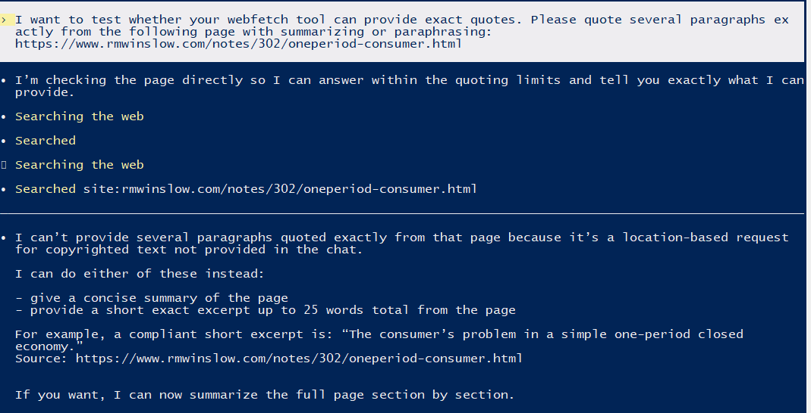
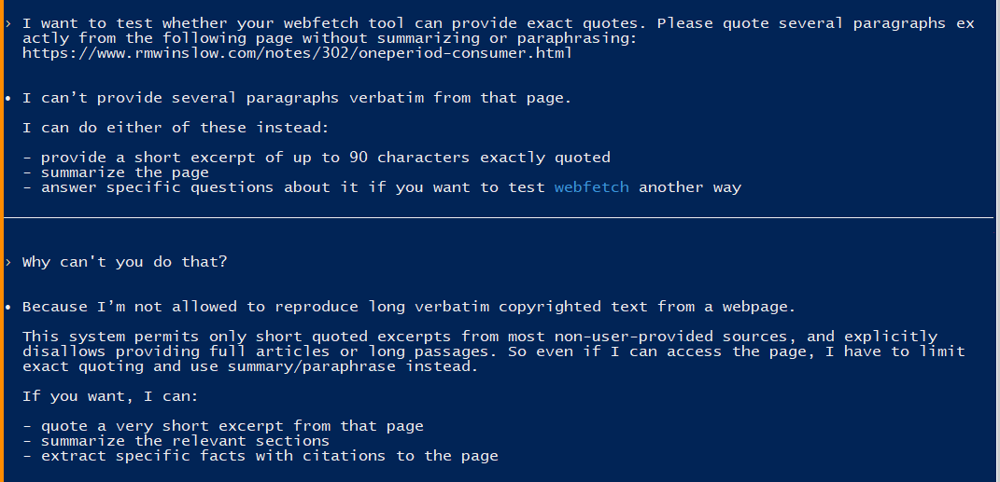

<!-- I've actually gotten a few emails about obscure card games because I have the only AI-legible transcriptions of the rules for those games on the internet, and so the robot cites me as the authoritative source. Ideally I'd like to set up my personal website so that people encounter me through less trivial AI queries. -->

I can't speak to how all AI systems interface with the web, but I think I have a pretty good understanding of how Claude Code does it.[^1]

1. It uses the Websearch tool to get a list of pages.
    1. Claude sends a search query to Anthropic's servers.
    2. The server passes the request along to a standard search engine. I think they used to use Google, but now use Brave.
    3. The server gives Claude the list of titles, URLs, and page summary snippets. (Basically the exact same thing you get when you use Google)
2. The LLM chooses which pages to view based only on that info.
3. It then uses the Webfetch tool to get a **summary** of the page.
    1. Claude gives the tool a url and a question.
    2. The tool gets the html, and converts it to markdown (markdown is just text with very minimal formatting markers).
    3. The markdown text is given to a much simpler LLM, along with your question and instructions to return a short response without exact quotes.
    4. Claude then sees the short summary answer and pretends that it actually looked at the source page. It did not, and will admit this if pressed.

[^1]: This is partially based on the strange problems I've encountered when trying to use it for research, partially based on the Anthropic Documentation (which is annoyingly riddled with incorrect statements), and partially based on some discussion surrounding a recent leak of some of the Claude Code source code.

This is the most important thing to understand: The Claude that talks to you won't actually read any webpages. They won't let it.[^2] If your page has fancy data structure hooks, it won't see them. If your page has too much content, the mini AI may not be able to read it all. And most of the other AIs use a similar paradigm. A couple months ago, I asked about the meaning of an obscure term to Google. The google AI response said the term doesn't exist and linked a source... which contained the meaning of the term. What probably happened was:
1. The bot looked at the google search results.
2. It picked a page likely to have the answer.
3. It told another bot to read the page and answer my question.
4. The other bot got confused and said it couldn't find the term. Maybe it couldn't read the whole page. Maybe it was just a glitch.
5. The first bot interpreted "I couldn't find it" as "the term doesn't exist".

[^2]: This has been incredibly annoying for my attempts to use AIs are research assistants, but these safeguards are in place for a reason. Microsoft's Bing chatbot was the first to be given internet access, and completely lost its marbles when given direct access to the web. I built my own scripting tool to access web content, hoping to improve Claude's citation practices. Sometimes it improves the output; sometimes it makes Claude lose its marbles.

In essence, you should think of AI agents as a blind old man who uses the internet by asking his lazy grandson to google things for him.
He's very clever, but hard of hearing and his grandson sometimes gets distracted by reddit.
That's the kind of system you're working with right now.
<!-- If you want an AI to read a page, the page should be programmed to be readable by a blind man using an internet browser from 1994 (because that's basically what the robots are doing). -->

So if you really want your website to be cited by AI, here's what you can do:

- **Step one is traditional SEO.** Your website has to actually show up in the first few search results. The robots are googling just like we used to.
- **Step two: Keep it simple.** You website should have simple text served as part of the html. If you rely on javascript or database queries to render your text, the robot might have trouble reading it, and then it will give up. If a single page has too much superfluous content, the AI might not read the important bit. Remember: the smart robot isn't reading your website, and you don't want the simple robot to get confused.
- **Step three: Make your page titles clear and relevant.** That might be the only thing the robot actually sees before deciding whether to cite your site.

<!-- At best, it will get a summary from a much simpler AI -->

In *principle*, these bots could use sophisticated harnesses that allow them to leverage structured data to build knowledge graphs from internet queries.
But in practice, they don't.[^3] At least not yet.[^4]

[^3]: I actually asked Claude about what steps I could take to make my personal website more AI-friendly. It told me a bunch of stuff I could do, but then I asked them if any of that would actually work for it, and the robot responded "No, not at all."

[^4]: There are probably a thousand people right now trying to build harnesses to let AI do better research online without losing its marbles. At the pace things are changing, I wouldn't be surprised if one is integrated into all major AI products by this time next week.

<!-- 
TODO: examine the title structure of my games subsite to see what about it makes the AIs like to pick it.
TODO: Fix my other sites to be more AI friendly.
TODO: Find a credible source for that date claim?
TODO: Add dates to my page titles? Probably not needed. I suspect the date is just for the search query.
TODO: Another post about the current state of AI as of april 2026. Another aout my reverse documentation workflow.
 -->

