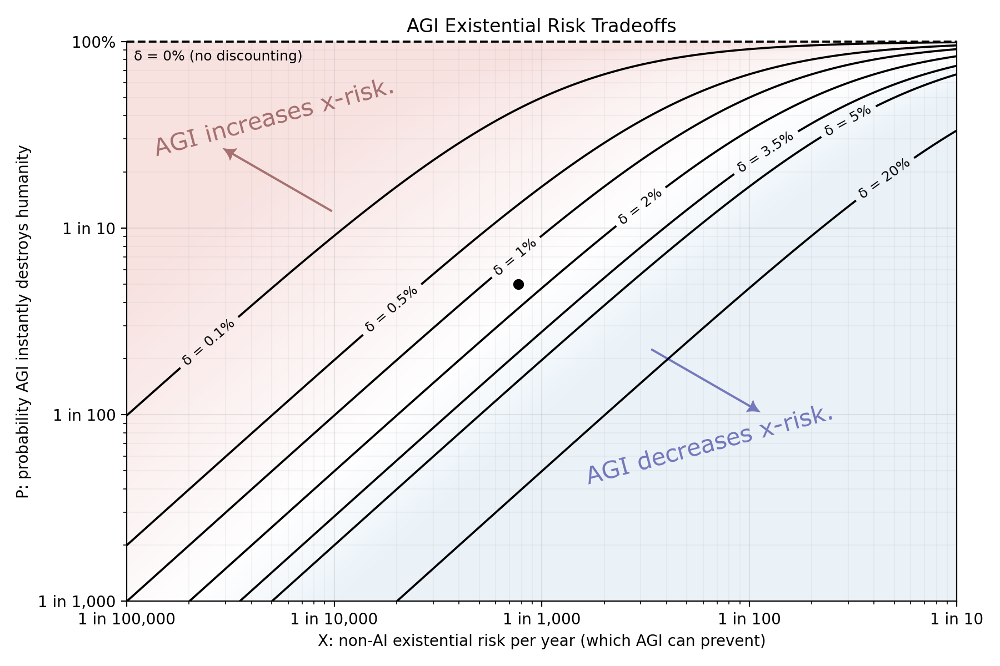

In ["If No One Builds It, Everyone Dies"](https://nicholasdecker.substack.com/p/why-we-should-be-less-concerned-about)[^buildbook]
Nicholas Decker argues that it's ethical to risk human extinction 
by developing a powerful technology like AGI,[^AGI] 
since that tech would reduce the risk of death and extinction from other causes. 

[^buildbook]: The title is a reference to a Book about AI called [If Anyone Builds It, Everyone Dies](https://ifanyonebuildsit.com/).

This is the bit that nerd-sniped me:

> If you are a utilitarian, whether or not we should accept the risk is simply a matter of what parameters you believe about extinction risk, the future flow utility of humanity living without AGI, and the future utility of humans with AGI.

[^AGI]: AGI: Artifical General Intelligence. Super duper intelligent AI that's good at everything.

So this is a silly exercise, but sure, let's take a moment to look at the first parameter there. Spoiler: 4%. It'll make sense later.

## Extinction Risk Only

For simplicity, let's assume you want humans and human civilization to continue to exist as we know it, and you don't particularly care about the details, or even whether you're around to see it.[^posterity]

[^posterity]: The latter isn't even a particularly weird assumption. People sacrifice for posterity all the time, and it makes perfect sense within all sorts of preference frameworks. I mean, when people say that having kids is a form of immortality, it isn't *just* a metaphor.

The parameters are as follows:

- You have $u$ units of utility for each year humanity endures,
- you discount the future at rate $\delta$,
- and there's a risk $x$ that humanity goes extinct or otherwise ceases to endure.

Your expected utility looks like this:

$$
U = \sum_{t=0}^\infty \left(1-x \over 1+\delta \right)^t \cdot u
=
\frac{(1+\delta)u}{\delta+x}
$$

Now let's say AGI does two things:

- It instantly destroys us with probability $p$
- but it also adjusts the ongoing extinction risk from $x$ to $q\cdot x$.

If you press the AGI button, your expected utility will be:

$$
U_{agi} = \sum_{t=0}^\infty \left(1-q\cdot x \over 1+\delta \right)^t \cdot u
=
(1-p)\frac{(1+\delta)u}{\delta+qx}
$$

### Should You Turn On The AGI?

If we're expected utility maximizers, 
then we should push the AGI button iff $U_{agi} > U$, which is true when:

$$
p < \frac{(1-q)x}{\delta +x}
$$

<!-- Same ultimate condition in continuous time. Just each utility lacks the (1-delta) factor in the numerator. -->

Let's be generous to the robot, and assume that AGI completely removes all other extinction risks, allowing humanity to endure in perpetuity. 
($q=0$).[^otheroptions]

[^otheroptions]: We're also being generous to the AGI by assuming that there aren't *other* ways to remove existential risk which don't create *new* existential risk of their own.

And let's use the "standard" 2% discount rate for $\delta$.

What number should we use for the non-ai extinction risk?
Based on our survival as a species so far, [the "background rate" of human extinction is probably much less than 10e-4](https://www.nature.com/articles/s41598-019-47540-7), 
but modern times allow for modern means of extinction, and it isn't *just* total extinction that we care about,
but any sort of permanent end to human civilization.
In *The Precipice* Toby Ord gives [estimates for various existential risks](https://forum.effectivealtruism.org/posts/Z5KZ2cui8WDjyF6gJ/some-thoughts-on-toby-ord-s-existential-risk-estimates). He warns us not to take the numbers too seriously, but he estimates a 1/6 overall change of catastrophe this century, and 1/10 from AI in particular. If the AI and non-AI risks are independent, that gives a 1/13 risk of non-ai extinction this century, and about 1/1300 per year.

$$
p < \frac{1/1300}{1/50 + 1/1300} = \frac{1}{27} \approx 3.7\%
$$

So don't summon the machine-god unless there's less than a one-in-30 chance it destroys the world as we know it? Sure. Sounds reasonable to me.

Alas, the median estimate in [This Survey](https://arxiv.org/abs/2401.02843) suggests a $p$ above the threshold.
> We asked participants to assume that, at some point, “high-level machine intelligence” (HLMI) will exist, as defined in Section 3.2. Given this assumption for the sake of the question, we asked how good or bad they expect the overall impact of this to be “in the long run” for humanity. ... The median prediction for extremely bad outcomes, such as human extinction, was 5% (mean 9%). 

Here's a plot showing the relationship between
instant AGI x-risk (vertical axis), annual non-AI x-risk (horizontal), and the threshold for the existential risk from AGI being "worth it".

The contours show the thresholds at various discount rates. (If you don't discount the future, then the threshold is at $p<1$ because those glorious infinite futures make any risk worth it.)
At the point estimate of $x=\frac{1}{1300}$, $p=\frac{1}{20}$, 
AGI *increases* the time-discounted x-risk at an annual discount factor of 2%,
but decreases discounted x-risk with a discount factor of 1%. 

If AGI doesn't fully remove all other forms of risk, then the threshold scales down proportionally. Eg. if the AGI only removes one third of non-AI risk, 
then $1-q=\frac{1}{3}$, and the threshold for AGI being a net bad will be only one third as high.

## And what about the welfare impact?

The above calculations assume AGI
just alters the risk of existential catastrophe, 
but we know it could do all sorts of other stuff too.
It could cure all diseases and end hunger, or it could trap us in eternal torment.
There probably *are* ways to think about
tail-event welfare impacts without 
devolving into a double-sided Pascal's wager,[^coinflip]
but I've spent enough time on this tangent for today.

[^coinflip]: Pascal's coinflip. A gamble that could send you to heaven or hell. Hrm.

Bottom line: Don't press the fix everything button if it has more than a 4% chance of exploding.

